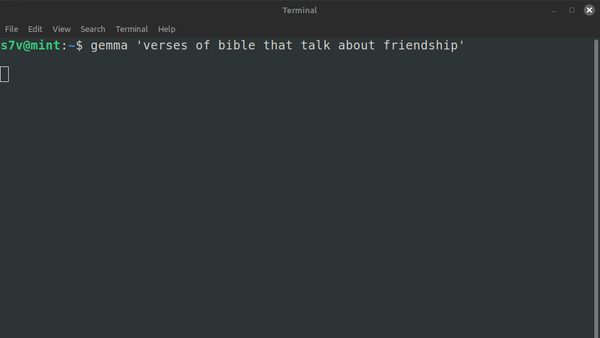

## Simple script that highlights each line Ollama puts into terminal

```
git clone https://github.com/esteban-elias/markdown-ollama.git
```
### Example usage:
```
python3 main.py ollama run gemma2:2b 'verses of bible that talk about friendship'
```

Or just create a function inside .bashrc
```
function gemma () {
	if [[ -z $1 ]]
	then
		ollama run gemma2:2b
		return
	fi
	python3 ~/coding/scripts/markdown-ollama/main.py ollama run gemma2:2b $1 
}

```
And call it from the terminal
```
gemma 'verses of bible that talk about friendship'
```



