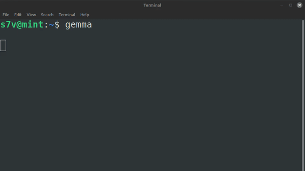

## Simple wrapper to show Ollama's response in Markdown

```
git clone https://github.com/esteban-elias/markdown-ollama.git
```
```
pip install rich
```

### Example usage:

```
python3 main.py ollama run gemma2:2b
```

Or just create a function inside .bashrc

```
function gemma () {
    if [[ -z $1 ]]
    then
        /home/s7v/coding/scripts/markdown-ollama/venv/bin/python ~/coding/scripts/markdown-ollama/main.py ollama run gemma2:2b 'Say hi to me'
        return
    fi
    /home/s7v/coding/scripts/markdown-ollama/venv/bin/python ~/coding/scripts/markdown-ollama/main.py ollama run gemma2:2b "$1"
}
```

And call it from the terminal

```
gemma
```


